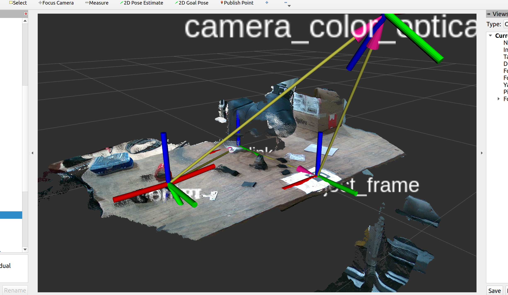

# Sort and Segregate Project

## Overview

The main aim of the project was to separate coloured springs from a pile of rubbish, using the M1013 Doosan Robot Arm with the OnRobot RG6 gripper and the Intel Realsense D455 Camera. This package contains functions to simulate and control the M1013 Doosan Robot and D455 Camera in ROS2 Humble. The OnRobot RG6 gripper can be visualized however the drivers lack functionality, but can be controlled through the Doosan's digital outputs.

## Physical Environment Setup:

### OnRobot RG6:
- When powered on green light will display on the side and can acces web client using the grippers ip (192.168.1.1)
- Make sure in the WebLogic tab the 'spring_grip' is running

### Doosan M1013:
- Using the teach pendent ensure that the safety zone is enabled and set correctly so it can't collide with the camera
- Ensure the gripper weight is set to grippy_tool
- Check if the gripper controls are working by entering status and turning on and off the contoller digital output port 1
- The IP of the robot is set to 192.168.1.100 (if changed will have to change the argument upon launch)

### D455 Camera:
- Make sure to connect the camera to the laptop using a 3.2 USB
- Install the Realsense SDK and library on the laptop

### Aruco Markers:
- Print off the aruco marker given in the github
- Place the Aruco marker in the environment ensuring it is visible to the camera.


## ROS Workspace Setup:
***This ROS2 Package is implemented at ROS2-humble.***

### Installation:
```
### Prerequisites to installat before installing the package
$ sudo apt install ros-humble-librealsense2*
$ sudo apt install ros-humble-realsense2-*
$ sudo apt install ros-humble-aruco
$ sudo apt install ros-humble-image-view
$ sudo apt install ros-humble-ros2-control
$ sudo apt-get install libpoco-dev libyaml-cpp-dev
$ sudo apt-get install ros-humble-control-msgs ros-humble-realtime-tools ros-humble-xacro ros-humble-joint-state-publisher-gui ros-humble-ros2-control ros-humble-ros2-controllers ros-humble-gazebo-msgs ros-humble-moveit-msgs dbus-x11

### Recommended to use the /home/<user>/ros2_ws/src
$ mkdir -p ~/ros2_ws/src
$ cd ~/ros2_ws/src
$ git clone -b sort_seg https://github.com/lib-salt/Sort-and-Segregate
$ rosdep install -r --from-paths . --ignore-src --rosdistro $ROS_DISTRO -y
$ cd src/Sort-and-Segregate
$ ./install_emulator.sh
$ cd ~/ros2_ws
$ colcon build
$ . install/setup.bash
```

## Launch: 

### Doosan Simulation:
To launch a basic simulation of the doosan robot can be done by running the following command:

```
  ros2 launch dsr_bringup2 dsr_bringup2_gazebo.launch.py mode:=virtual host:=127.0.0.1
```

Alternatively a connection to the robot can be made by setting the mode to real and changing the host address.


### Visualise Doosan and Gripper:
Allow for visualisation of the robot and gripper in rviz:

```
ros2 launch m1013_moveit_config start.launch.py color:=blue
```


### Camera Node:
To launch just the camera node run the following command:

```
  ros2 launch sort_seg rs_launch.py
```

To view the camera output, use the Intel RealSense Viewer to visualize the live feed from the camera.
```
realsense-viewer
```

Alternatively you can use another image viewer:
```
rqt
```
Then navigate to Plugins > Visualisation > Image View and select the relevant topic to check for output.


### Aruco Markers Visualisation:
To start tracking the marker and publish its pose in the camera frame run the following command:
```
  ros2 launch sort_seg quadruple.launch.py
```

Allow for visualisation of the aruco marker and it's pose in the camera frame:
```
ros2 run image-view image-view --ros-args --remap image:=/aruco_quadruple/result
```


### Launching the Sort Segregate Programme:
To launch the Sort and Segregate spring task use:

```
ros2 launch sort_seg sort_seg.launch.py
```

### Visualising the Whole Setup
Allow for visualisation of the entire setup through RViz2:
```
rviz2
```

Open TF Frames, and visualise the following Frames:
- camera_color_optical_frame
- base_link
- spring
- marker2_object_frame
- center
- link i (if you want to visualise the links of the robot)

Open DepthCloud, and open the following topics to visualise the camera's output:
- **Depth Map Topic:** /camera/camera/aligned_depth_to_color/image_raw
- **Color Image Topic:** /camera/camera/color/image_raw



-----------------------------------------------------------------------------------------------------------------
## Further Documentation:
Further documentation and resources for the Doosan robot and gripper can be found at the github repositories below:

https://github.com/doosan-robotics/doosan-robot2/tree/humble-devel (Doosan Robotics)

https://github.com/Osaka-University-Harada-Laboratory/onrobot (OnRobot gripper ROS1)

https://github.com/BrettRD/onrobot_grippers (OnRobot gripper ROS2)

https://github.com/pal-robotics/aruco_ros (Aruco Markers ROS)

https://github.com/IntelRealSense/realsense-ros (Intel Realsense ROS)


